# Board silkscreen ↔ MPF number reference

Cross-references every physical board's **silkscreen pin labels** (what you can actually read off
the board in a photo or in person) against the **MPF chain-board-index numbers** this project's
config uses (`0-0-8`, `2-1-16`, etc.). Built by extracting the embedded photos and per-pin data
tables from `board Overviews.xlsx` (never previously pulled out of that file into a real doc) —
see `docs/board-photos/` for the saved images this doc references.

**This reflects `board Overviews.xlsx`'s original/historical pin assignments, not necessarily
what's wired today.** Several components have moved since (flippers, slings, plunger, trough-eject
→ Cobra board — see `CHANGES.md` entries 11-14). For **current, live status**, always check
`tools/hw_console/data/components.yaml` / `docs/wiring-pin-map.md` — this doc is for identifying
*which physical pin* a given MPF number lands on, not for what's currently wired there.

## How to use this with a photo

1. Identify the board family from the photo: **CobraPin** (green PCB, "COBRAPIN PINBALL
   CONTROLLER" silkscreen, STM32 chips) or **red board / PSOC4200** (red PCB, `CY8CKIT-049-42XX`
   silkscreen, PSoC 4 chip, `P0.x`/`P1.x`/`P2.x`/`P3.x` pin labels along the header edges).
2. For CobraPin: read the connector label (`J1`-`J12`, silkscreened near each header) and the pin
   position within it, then look up that connector/pin in the [CobraPin connector
   table](#cobrapin-stm32-connector-mapping) below.
3. For a red board: read the `P#.#` label next to the pin, then look up that physical pin in the
   [PSOC4200 table](#psoc4200-red-board-per-pin-reference) below for the specific board (chain 2,
   address `0x20`-`0x23`) — **the four red boards are physically identical and not distinguishable
   from silkscreen alone**; which one you're looking at comes from which position it occupies in
   the chain2 daisy-chain (see `docs/opp-hardware-reference.md`), not anything printed on the PCB.
4. Cross-check the resulting MPF number against `tools/hw_console/data/components.yaml` for what's
   *actually* wired there today, not just what this historical sheet says.

## CobraPin (chain 0 / chain 1)

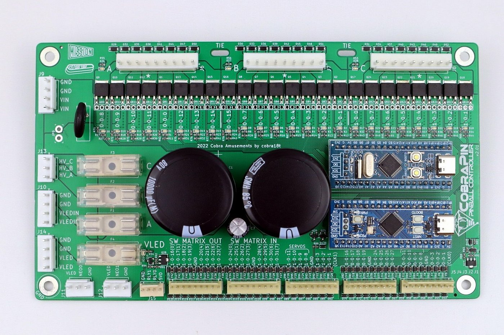

The coil bank's silkscreen prints the MPF number directly next to each pin (visible above:
`0-0-8`, `0-0-9`, `0-0-10`, `0-0-11`, `0-0-0`, `0-0-12`, `0-0-13`, `0-0-14` for Bank A, continuing
through Banks B/C) — for the solenoid banks, the photo itself *is* the reference, no lookup table
needed.

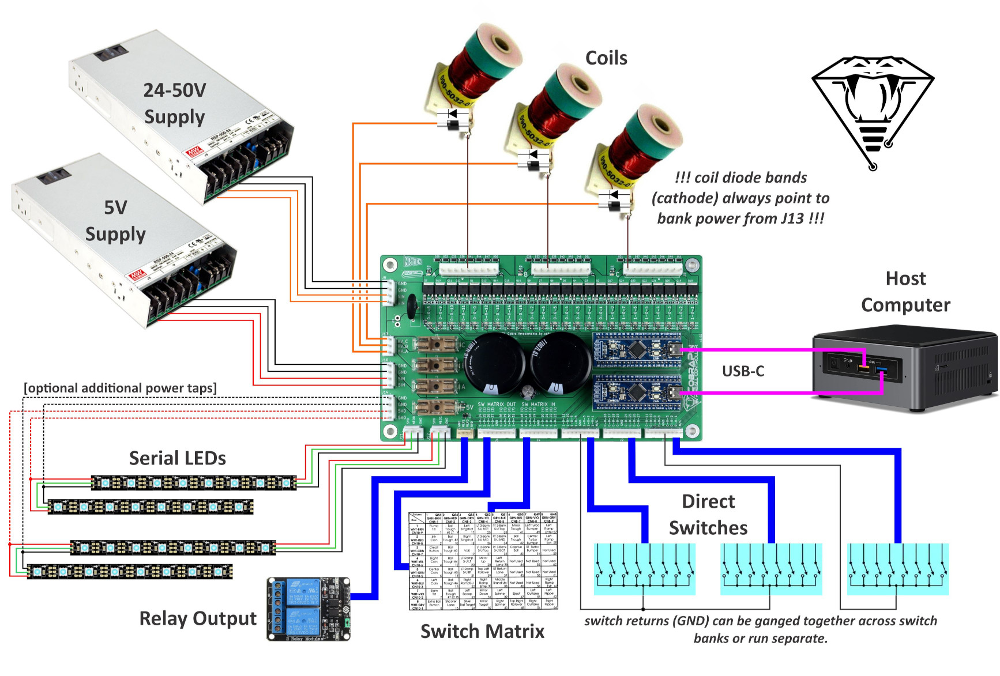

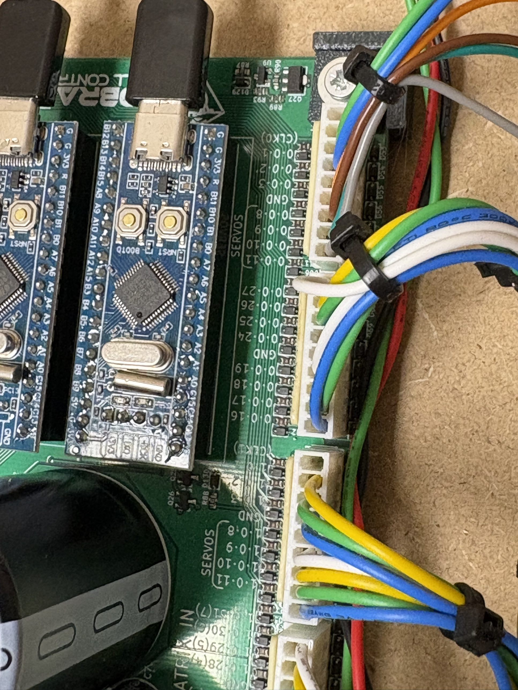

The header connectors (`J1`-`J12`, used for switch inputs and the inter-board ribbon chain)
silkscreen the MPF number directly too — confirmed on this cabinet's own board (the close-up
photo above reads `0-0-1`, `0-0-2`, `0-0-3`, `GND`, `0-0-8`-`0-0-11` under a "SERVOS" bracket,
then `0-0-27`-`0-0-24`, `GND`, `0-0-19`-`0-0-16` — exactly `J1` pins 2-9 then `J2` pins 1-9 from
the table below, run together on one physical header) and by CobraPin's own
documentation: *"The switch inputs are labeled in silkscreen with the MPF compatible numbers"*
(same for coil outputs) — see `cobrapin-official-wiki` in `docs/references/`. An earlier version
of this doc claimed the opposite for these connectors specifically; that was wrong. The table
below (matching the silkscreen 1:1) is still useful as a compact reference and for the STM32/pin
detail the silkscreen doesn't show:

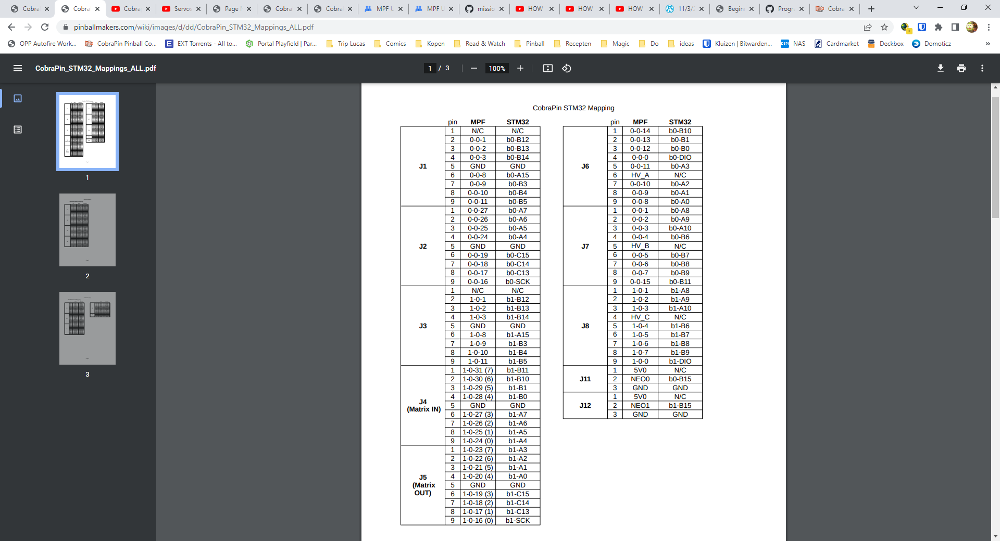

### CobraPin STM32 connector mapping

Source: `CobraPin_STM32_Mappings_ALL.pdf`, pinballmakers.com (embedded in `board Overviews.xlsx`'s
`Cobrapin - Doc` sheet). `chain0-0x20` = `b0-*` pins below, `chain1-0x20` = `b1-*` pins.

| Connector | Pin | MPF number | STM32 pin |
|---|---|---|---|
| J1 | 1 | N/C | N/C |
| J1 | 2 | `0-0-1` | b0-B12 |
| J1 | 3 | `0-0-2` | b0-B13 |
| J1 | 4 | `0-0-3` | b0-B14 |
| J1 | 5 | GND | GND |
| J1 | 6 | `0-0-8` | b0-A15 |
| J1 | 7 | `0-0-9` | b0-B3 |
| J1 | 8 | `0-0-10` | b0-B4 |
| J1 | 9 | `0-0-11` | b0-B5 |
| J2 | 1 | `0-0-27` | b0-A7 |
| J2 | 2 | `0-0-26` | b0-A6 |
| J2 | 3 | `0-0-25` | b0-A5 |
| J2 | 4 | `0-0-24` | b0-A4 |
| J2 | 5 | GND | GND |
| J2 | 6 | `0-0-19` | b0-C15 |
| J2 | 7 | `0-0-18` | b0-C14 |
| J2 | 8 | `0-0-17` | b0-C13 |
| J2 | 9 | `0-0-16` | b0-SCK |
| J3 | 1 | N/C | N/C |
| J3 | 2 | `1-0-1` | b1-B12 |
| J3 | 3 | `1-0-2` | b1-B13 |
| J3 | 4 | `1-0-3` | b1-B14 |
| J3 | 5 | GND | GND |
| J3 | 6 | `1-0-8` | b1-A15 |
| J3 | 7 | `1-0-9` | b1-B3 |
| J3 | 8 | `1-0-10` | b1-B4 |
| J3 | 9 | `1-0-11` | b1-B5 |
| J4 (Matrix IN) | 1 | `1-0-31` (7) | b1-B11 |
| J4 (Matrix IN) | 2 | `1-0-30` (6) | b1-B10 |
| J4 (Matrix IN) | 3 | `1-0-29` (5) | b1-B1 |
| J4 (Matrix IN) | 4 | `1-0-28` (4) | b1-B0 |
| J4 (Matrix IN) | 5 | GND | GND |
| J4 (Matrix IN) | 6 | `1-0-27` (3) | b1-A7 |
| J4 (Matrix IN) | 7 | `1-0-26` (2) | b1-A6 |
| J4 (Matrix IN) | 8 | `1-0-25` (1) | b1-A5 |
| J4 (Matrix IN) | 9 | `1-0-24` (0) | b1-A4 |
| J5 (Matrix OUT) | 1 | `1-0-23` (7) | b1-A3 |
| J5 (Matrix OUT) | 2 | `1-0-22` (6) | b1-A2 |
| J5 (Matrix OUT) | 3 | `1-0-21` (5) | b1-A1 |
| J5 (Matrix OUT) | 4 | `1-0-20` (4) | b1-A0 |
| J5 (Matrix OUT) | 5 | GND | GND |
| J5 (Matrix OUT) | 6 | `1-0-19` (3) | b1-C15 |
| J5 (Matrix OUT) | 7 | `1-0-18` (2) | b1-C14 |
| J5 (Matrix OUT) | 8 | `1-0-17` (1) | b1-C13 |
| J5 (Matrix OUT) | 9 | `1-0-16` (0) | b1-SCK |
| J6 | 1 | `0-0-14` | b0-B10 |
| J6 | 2 | `0-0-13` | b0-B1 |
| J6 | 3 | `0-0-12` | b0-B0 |
| J6 | 4 | `0-0-0` | b0-DIO |
| J6 | 5 | `0-0-11` | b0-A3 |
| J6 | 6 | HV_A | N/C |
| J6 | 7 | `0-0-10` | b0-A2 |
| J6 | 8 | `0-0-9` | b0-A1 |
| J6 | 9 | `0-0-8` | b0-A0 |
| J7 | 1 | `0-0-1` | b0-A8 |
| J7 | 2 | `0-0-2` | b0-A9 |
| J7 | 3 | `0-0-3` | b0-A10 |
| J7 | 4 | `0-0-4` | b0-B6 |
| J7 | 5 | HV_B | N/C |
| J7 | 6 | `0-0-5` | b0-B7 |
| J7 | 7 | `0-0-6` | b0-B8 |
| J7 | 8 | `0-0-7` | b0-B9 |
| J7 | 9 | `0-0-15` | b0-B11 |
| J8 | 1 | `1-0-1` | b1-A8 |
| J8 | 2 | `1-0-2` | b1-A9 |
| J8 | 3 | `1-0-3` | b1-A10 |
| J8 | 4 | HV_C | N/C |
| J8 | 5 | `1-0-4` | b1-B6 |
| J8 | 6 | `1-0-5` | b1-B7 |
| J8 | 7 | `1-0-6` | b1-B8 |
| J8 | 8 | `1-0-7` | b1-B9 |
| J8 | 9 | `1-0-0` | b1-DIO |
| J11 | 1 | 5V0 | N/C |
| J11 | 2 | NEO0 | b0-B15 |
| J11 | 3 | GND | GND |
| J12 | 1 | 5V0 | N/C |
| J12 | 2 | NEO1 | b1-B15 |
| J12 | 3 | GND | GND |

## PSOC4200 (red boards, chain 2)

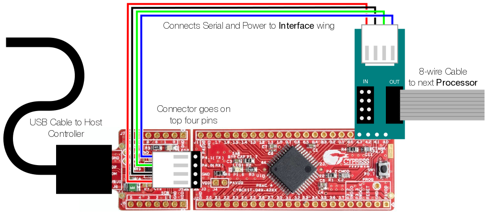

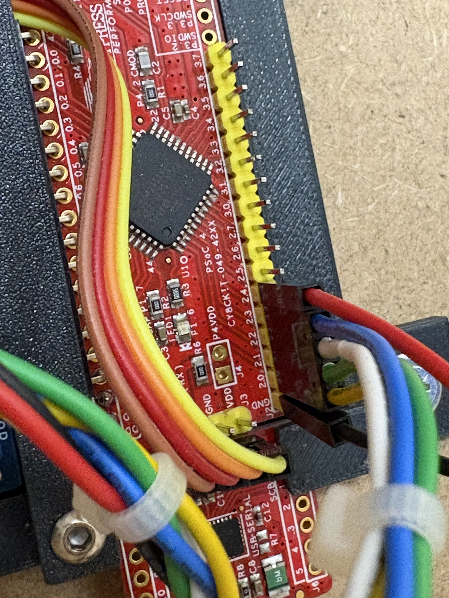

Unlike CobraPin, the red board's silkscreen only prints the raw **physical PSoC4200 pin label**
(`P0.0`-`P0.7`, `P1.0`-`P1.7`, `P2.0`-`P2.7`, `P3.0`-`P3.7`) — never the MPF number directly. The
tables below (extracted from `board Overviews.xlsx`'s `PSOC4200 - Game Function` sheet) give the
physical-pin ↔ MPF-number mapping for each of the four boards. "Game-function name (historical)"
is this sheet's own original device naming — cross-check against `components.yaml` for the current
name/status, since names and assignments have both drifted since this sheet was last updated.

### PSOC4200 red-board per-pin reference

Each board gets a generated visual (silkscreen pin / MPF number / device name, color-coded by
function) followed by the same data as a table — the visual for a quick glance while looking at
the physical board, the table for searching/scanning.

#### chain2-0x20

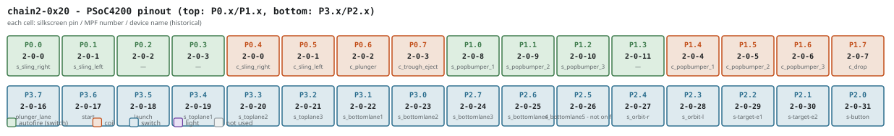

| Physical pin | Pin index | MPF number | Function | Game-function name (historical) |
|---|---|---|---|---|
| 0.0 | 0 | `2-0-0` | auto fire | s_sling_right |
| 0.1 | 1 | `2-0-1` | auto fire | s_sling_left |
| 0.2 | 2 | `2-0-2` | auto fire | #NA |
| 0.3 | 3 | `2-0-3` | auto fire | #NA |
| 0.4 | 0 | `2-0-0` | coil | c_sling_right |
| 0.5 | 1 | `2-0-1` | coil | c_sling_left |
| 0.6 | 2 | `2-0-2` | coil | c_plunger |
| 0.7 | 3 | `2-0-3` | coil | c_trough_eject |
| 1.0 | 8 | `2-0-8` | auto fire | s_popbumper_1 |
| 1.1 | 9 | `2-0-9` | auto fire | s_popbumper_2 |
| 1.2 | 10 | `2-0-10` | auto fire | s_popbumper_3 |
| 1.3 | 11 | `2-0-11` | auto fire | #NA |
| 1.4 | 4 | `2-0-4` | coil | c_popbumper_1 |
| 1.5 | 5 | `2-0-5` | coil | c_popbumper_2 |
| 1.6 | 6 | `2-0-6` | coil | c_popbumper_3 |
| 1.7 | 7 | `2-0-7` | coil | c_drop |
| 3.7 | 16 | `2-0-16` | switch | plunger_lane |
| 3.6 | 17 | `2-0-17` | switch | start |
| 3.5 | 18 | `2-0-18` | switch | launch |
| 3.4 | 19 | `2-0-19` | switch | s_toplane1 |
| 3.3 | 20 | `2-0-20` | switch | s_toplane2 |
| 3.2 | 21 | `2-0-21` | switch | s_toplane3 |
| 3.1 | 22 | `2-0-22` | switch | s_bottomlane1 |
| 3.0 | 23 | `2-0-23` | switch | s_bottomlane2 |
| 2.7 | 24 | `2-0-24` | switch | s_bottomlane3 |
| 2.6 | 25 | `2-0-25` | switch | s_bottomlane4 |
| 2.5 | 26 | `2-0-26` | switch | s_bottomlane5 - not on field |
| 2.4 | 27 | `2-0-27` | switch | s_orbit-r |
| 2.3 | 28 | `2-0-28` | switch | s_orbit-l |
| 2.2 | 29 | `2-0-29` | switch | s-target-e1 |
| 2.1 | 30 | `2-0-30` | switch | s-target-e2 |
| 2.0 | 31 | `2-0-31` | switch | s-button |

#### chain2-0x21

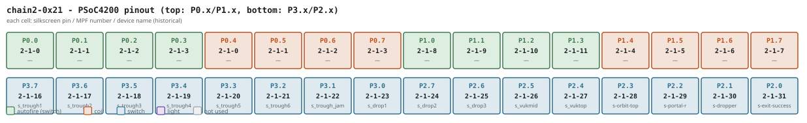

| Physical pin | Pin index | MPF number | Function | Game-function name (historical) |
|---|---|---|---|---|
| 0.0 | 0 | `2-1-0` | auto fire | *(empty)* |
| 0.1 | 1 | `2-1-1` | auto fire | *(empty)* |
| 0.2 | 2 | `2-1-2` | auto fire | *(empty)* |
| 0.3 | 3 | `2-1-3` | auto fire | *(empty)* |
| 0.4 | 0 | `2-1-0` | coil | *(empty)* |
| 0.5 | 1 | `2-1-1` | coil | *(empty)* |
| 0.6 | 2 | `2-1-2` | coil | *(empty)* |
| 0.7 | 3 | `2-1-3` | coil | *(empty)* |
| 1.0 | 8 | `2-1-8` | auto fire | *(empty)* |
| 1.1 | 9 | `2-1-9` | auto fire | *(empty)* |
| 1.2 | 10 | `2-1-10` | auto fire | *(empty)* |
| 1.3 | 11 | `2-1-11` | auto fire | *(empty)* |
| 1.4 | 4 | `2-1-4` | coil | *(empty)* |
| 1.5 | 5 | `2-1-5` | coil | *(empty)* |
| 1.6 | 6 | `2-1-6` | coil | *(empty)* |
| 1.7 | 7 | `2-1-7` | coil | *(empty)* |
| 3.7 | 16 | `2-1-16` | switch | s_trough1 |
| 3.6 | 17 | `2-1-17` | switch | s_trough2 |
| 3.5 | 18 | `2-1-18` | switch | s_trough3 |
| 3.4 | 19 | `2-1-19` | switch | s_trough4 |
| 3.3 | 20 | `2-1-20` | switch | s_trough5 |
| 3.2 | 21 | `2-1-21` | switch | s_trough6 |
| 3.1 | 22 | `2-1-22` | switch | s_trough_jam |
| 3.0 | 23 | `2-1-23` | switch | s_drop1 |
| 2.7 | 24 | `2-1-24` | switch | s_drop2 |
| 2.6 | 25 | `2-1-25` | switch | s_drop3 |
| 2.5 | 26 | `2-1-26` | switch | s_vukmid |
| 2.4 | 27 | `2-1-27` | switch | s_vuktop |
| 2.3 | 28 | `2-1-28` | switch | s-orbit-top |
| 2.2 | 29 | `2-1-29` | switch | s-portal-r |
| 2.1 | 30 | `2-1-30` | switch | s-dropper |
| 2.0 | 31 | `2-1-31` | switch | s-exit-success |

#### chain2-0x22 (also carries the incandescent wing)

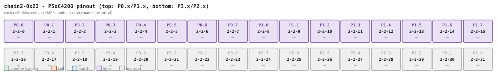

| Physical pin | Pin index | MPF number | Function |
|---|---|---|---|
| 0.0 | 0 | `2-2-0` | light |
| 0.1 | 1 | `2-2-1` | light |
| 0.2 | 2 | `2-2-2` | light |
| 0.3 | 3 | `2-2-3` | light |
| 0.4 | 4 | `2-2-4` | light |
| 0.5 | 5 | `2-2-5` | light |
| 0.6 | 6 | `2-2-6` | light |
| 0.7 | 7 | `2-2-7` | light |
| 1.0 | 8 | `2-2-8` | light |
| 1.1 | 9 | `2-2-9` | light |
| 1.2 | 10 | `2-2-10` | light |
| 1.3 | 11 | `2-2-11` | light |
| 1.4 | 12 | `2-2-12` | light |
| 1.5 | 13 | `2-2-13` | light |
| 1.6 | 14 | `2-2-14` | light |
| 1.7 | 15 | `2-2-15` | light |
| 3.7-2.0 | 16-31 | `2-2-16` … `2-2-31` | not used (per this historical sheet — double-check against current `components.yaml` before assuming still true) |

#### chain2-0x23

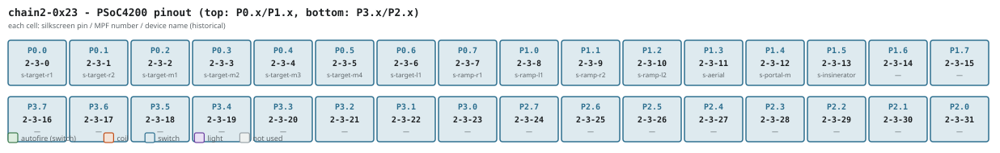

| Physical pin | Pin index | MPF number | Function | Game-function name (historical) |
|---|---|---|---|---|
| 0.0 | 0 | `2-3-0` | switch | s-target-r1 |
| 0.1 | 1 | `2-3-1` | switch | s-target-r2 |
| 0.2 | 2 | `2-3-2` | switch | s-target-m1 |
| 0.3 | 3 | `2-3-3` | switch | s-target-m2 |
| 0.4 | 4 | `2-3-4` | switch | s-target-m3 |
| 0.5 | 5 | `2-3-5` | switch | s-target-m4 |
| 0.6 | 6 | `2-3-6` | switch | s-target-l1 |
| 0.7 | 7 | `2-3-7` | switch | s-ramp-r1 |
| 1.0 | 8 | `2-3-8` | switch | s-ramp-l1 |
| 1.1 | 9 | `2-3-9` | switch | s-ramp-r2 |
| 1.2 | 10 | `2-3-10` | switch | s-ramp-l2 |
| 1.3 | 11 | `2-3-11` | switch | s-aerial |
| 1.4 | 12 | `2-3-12` | switch | s-portal-m |
| 1.5 | 13 | `2-3-13` | switch | s-insinerator |
| 1.6 | 14 | `2-3-14` | switch | *(unlabeled in sheet)* |
| 1.7 | 15 | `2-3-15` | switch | *(unlabeled in sheet)* |
| 3.7-2.0 | 16-31 | `2-3-16` … `2-3-31` | switch | *(unlabeled in sheet)* |

## Generic OPP wing wiring (any red board)

Power/wire-color reference for the three wing types, independent of which specific board — from
`board Overviews.xlsx`'s `Coil`/`Switch`/`Incand` sheets:

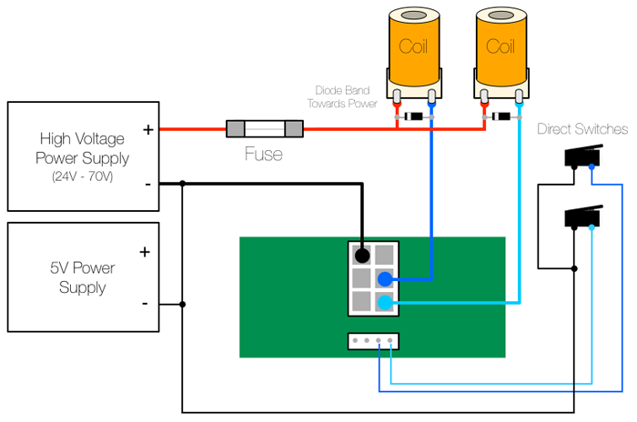
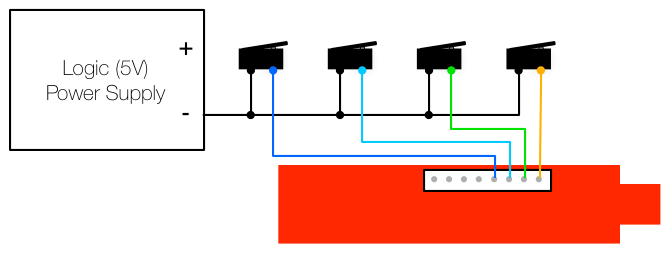
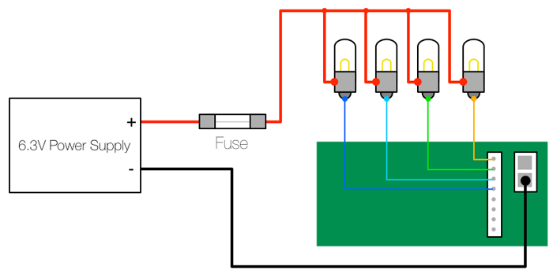

## Sources

- `board Overviews.xlsx` (repo root) — `Cobrapin - Doc`, `Cobrapin - Game Funtion`,
  `PSOC4200 - Doc`, `PSOC4200 - Config`, `PSOC4200 - Game Function`, `Coil`, `Switch`, `Incand`
  sheets, and their embedded images (extracted into `docs/board-photos/` for this doc — the xlsx
  itself is still never auto-parsed for live status, per `tools/hw_console/README.md`, this was a
  one-time manual extraction).
- `docs/opp-hardware-reference.md` — the board-priority policy and pairing rules this reference
  data feeds into.
