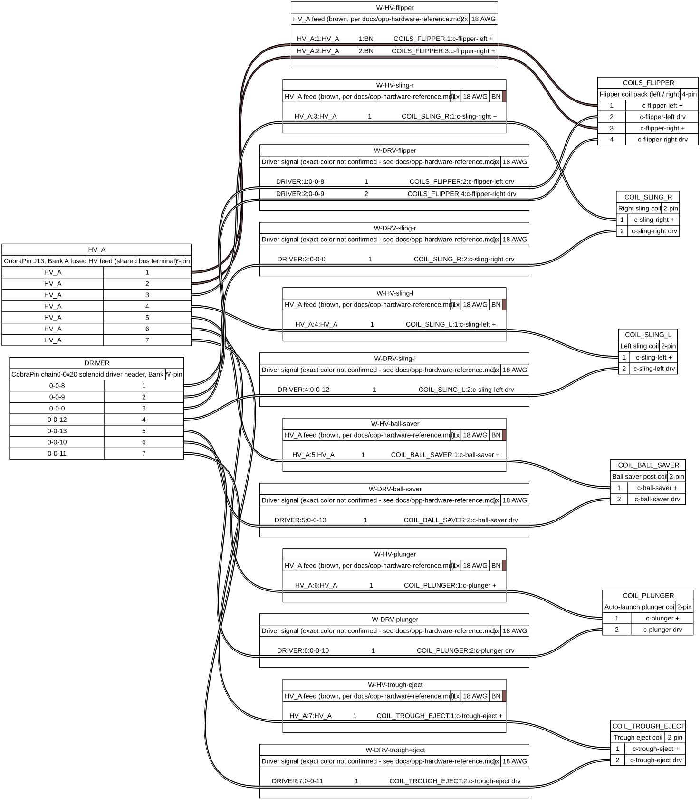

# Wiring guide

Board map, known-component wiring tables, and harness diagrams — the browsable overview of how
this machine is wired right now. **Generated** by `tools/hw_console/generate_docs.py` from
`tools/hw_console/data/components.yaml` and `machinefolder/config/hardware-*.yaml` — do not
hand-edit this file, it will be overwritten. For the step-by-step printable bench-test checklist
(what's been tested, when, pulse-ms tuning notes, pass/fail history), see the companion
`design/physical-checklists/wiring-guide.html` — open that one directly in a browser or print it
at the bench; it's kept separate on purpose so there's exactly one place that fast-changing log
gets updated, not two drifting copies.

Generated: 2026-09-14.

## Board map

Six physical CPU boards across three USB-serial chains. **This machine is being rewired from
scratch — board assignment follows a fixed priority: CobraPin first (chain 0, then chain 1), the
red PSOC boards (chain 2) only as a fallback when CobraPin can't fit something, and every LED
goes on CobraPin, no exceptions.** See [OPP hardware reference](/docs/opp-hardware-reference) for
the full rulebook — bank/HV-feed wiring, the red-board pairing rules, and why the two families
follow different numbering. Counts below are real, derived from `hardware-switches.yaml` /
`hardware-coils.yaml` / `hardware-leds.yaml` — remaining free capacity per board isn't tracked as
structured data anywhere in this repo (see `board Overviews.xlsx` or physical inspection for
that).

| Board | Port | Role | Switches in use | Coils in use | Reserved (off-limits) | LEDs in use |
|---|---|---|---|---|---|---|
| Chain 0 / Board 0x20 (CobraPin) | COM4 | cobrapin-switches-coils-leds | 8 | 7 | 4 | 40 |
| Chain 1 / Board 0x20 (CobraPin) | COM5 | cobrapin-switches-coils-leds | 0 | 0 | 0 | 1 |
| Chain 2 / Board 0x20 (PSOC card 0) | COM6 | psoc-switches-coils | 16 | 4 | 0 | 0 |
| Chain 2 / Board 0x21 (PSOC card 1) | COM6 | psoc-switches-coils | 16 | 1 | 0 | 0 |
| Chain 2 / Board 0x22 (PSOC card 2, incl. incandescent card) | COM6 | psoc-switches-coils-incand | 0 | 0 | 0 | 0 |
| Chain 2 / Board 0x23 (PSOC card 3) | COM6 | psoc-switches-coils | 20 | 0 | 0 | 0 |

## Components

One row per switch/coil pin — Component and Status are shown only on a group's first row.
Status is the 1-6 build-lifecycle stage from `components.yaml`
(`registry.COMPONENT_STATUSES`): 1 idea · 2 hardware, no purpose · 3 hardware with a purpose,
not renovated · 4 renovated, not wired · 5 wired, not tested · 6 wired & tested. Pin Silk Screen
is blank when not yet confirmed against a real board/photo; Other Pin is `GND` for every switch,
or a CobraPin coil's HV bank feed (`HV-A`/`HV-B`/`HV-C`) — blank for a red-board coil, since
none is wired yet.

| Component | Switches & Coils | Type | Board | Pin Silk Screen | Other Pin | MPF | Status |
|---|---|---|---|---|---|---|---|
| Slings (autofire) | s-left-sling | Switch | chain0-0x20 | 0-0-19 | GND | 0-0-19 | 6 — wired & tested |
|  | c-sling-left | Coil | chain0-0x20 | 0-0-12 | HV-A | 0-0-12 |  |
|  | s-right-sling | Switch | chain0-0x20 | 0-0-25 | GND | 0-0-25 |  |
|  | c-sling-right | Coil | chain0-0x20 | 0-0-0 | HV-A | 0-0-0 |  |
| Ball saver post | s-ball-saver | Switch | chain0-0x20 | 0-0-24 | GND | 0-0-24 | 6 — wired & tested |
|  | c-ball-saver | Coil | chain0-0x20 | 0-0-13 | HV-A | 0-0-13 |  |
| Pop bumpers (autofire) | s-popbumper-1 | Switch | chain2-0x20 |  | GND | 2-0-8 | 4 — renovated, not wired |
|  | c-popbumper-1 | Coil | chain2-0x20 |  |  | 2-0-4 |  |
|  | s-popbumper-2 | Switch | chain2-0x20 |  | GND | 2-0-9 |  |
|  | c-popbumper-2 | Coil | chain2-0x20 |  |  | 2-0-5 |  |
|  | s-popbumper-3 | Switch | chain2-0x20 |  | GND | 2-0-10 |  |
|  | c-popbumper-3 | Coil | chain2-0x20 |  |  | 2-0-6 |  |
| Plunger lane / auto-launch | s-plunger-lane | Switch | chain0-0x20 | 0-0-26 | GND | 0-0-26 | 6 — wired & tested |
|  | c-plunger | Coil | chain0-0x20 | 0-0-10 | HV-A | 0-0-10 |  |
| Start / launch cabinet buttons | s-start | Switch | chain0-0x20 | 0-0-27 | GND | 0-0-27 | 6 — wired & tested |
|  | s-launch | Switch | chain0-0x20 | 0-0-3 | GND | 0-0-3 |  |
| Ball trough | s-trough1 | Switch | chain2-0x21 | 3.7 | GND | 2-1-16 | 4 — renovated, not wired |
|  | s-trough2 | Switch | chain2-0x21 | 3.6 | GND | 2-1-17 |  |
|  | s-trough3 | Switch | chain2-0x21 | 3.5 | GND | 2-1-18 |  |
|  | s-trough4 | Switch | chain2-0x21 | 3.4 | GND | 2-1-19 |  |
|  | s-trough5 | Switch | chain2-0x21 | 3.3 | GND | 2-1-20 |  |
|  | s-trough6 | Switch | chain2-0x21 | 3.2 | GND | 2-1-21 |  |
|  | s-trough-jam | Switch | chain2-0x21 | 3.1 | GND | 2-1-22 |  |
|  | c-trough-eject | Coil | chain0-0x20 | 0-0-11 | HV-A | 0-0-11 |  |
| Drop target bank | s-drop1 | Switch | chain2-0x21 |  | GND | 2-1-23 | 3 — hardware with a purpose, not renovated |
|  | s-drop2 | Switch | chain2-0x21 |  | GND | 2-1-24 |  |
|  | s-drop3 | Switch | chain2-0x21 |  | GND | 2-1-25 |  |
|  | c-drop | Coil | chain2-0x20 |  |  | 2-0-7 |  |
| Top lanes (3) | s-toplane1 | Switch | chain2-0x20 |  | GND | 2-0-19 | 4 — renovated, not wired |
|  | s-toplane2 | Switch | chain2-0x20 |  | GND | 2-0-20 |  |
|  | s-toplane3 | Switch | chain2-0x20 |  | GND | 2-0-21 |  |
| Bottom lanes (4) | s-bottomlane1 | Switch | chain2-0x20 | 2.4 | GND | 2-0-27 | 6 — wired & tested |
|  | s-bottomlane2 | Switch | chain2-0x20 | 2.3 | GND | 2-0-28 |  |
|  | s-bottomlane3 | Switch | chain2-0x20 | 2.0 | GND | 2-0-31 |  |
|  | s-bottomlane4 | Switch | chain2-0x20 | 2.1 | GND | 2-0-30 |  |
| Rollover (grouped as a 5th bottom lane in the original harness/wiring) | s-bottomlane5 | Switch | chain2-0x20 | 2.2 | GND | 2-0-29 | 5 — wired, not tested |
| Orbits (left/right/top) | s-orbit-l | Switch | chain2-0x20 |  | GND | 2-0-23 | 1 — idea, no hardware yet |
|  | s-orbit-r | Switch | chain2-0x20 |  | GND | 2-0-22 |  |
|  | s-orbit-top | Switch | chain2-0x21 |  | GND | 2-1-28 |  |
| Standup targets (E/R/M/L banks) | s-target-e1 | Switch | chain2-0x20 |  | GND | 2-0-24 | 1 — idea, no hardware yet |
|  | s-target-e2 | Switch | chain2-0x20 |  | GND | 2-0-25 |  |
|  | s-target-r1 | Switch | chain2-0x23 |  | GND | 2-3-0 |  |
|  | s-target-r2 | Switch | chain2-0x23 |  | GND | 2-3-1 |  |
|  | s-target-m1 | Switch | chain2-0x23 |  | GND | 2-3-2 |  |
|  | s-target-m2 | Switch | chain2-0x23 |  | GND | 2-3-3 |  |
|  | s-target-m3 | Switch | chain2-0x23 |  | GND | 2-3-4 |  |
|  | s-target-m4 | Switch | chain2-0x23 |  | GND | 2-3-5 |  |
|  | s-target-l1 | Switch | chain2-0x23 |  | GND | 2-3-6 |  |
| Ramps (left/right, entry+exit) | s-ramp-r1 | Switch | chain2-0x23 |  | GND | 2-3-7 | 1 — idea, no hardware yet |
|  | s-ramp-l1 | Switch | chain2-0x23 |  | GND | 2-3-8 |  |
|  | s-ramp-r2 | Switch | chain2-0x23 |  | GND | 2-3-9 |  |
|  | s-ramp-l2 | Switch | chain2-0x23 |  | GND | 2-3-10 |  |
| VUKs (mid-field, top) | s-vukmid | Switch | chain2-0x21 |  | GND | 2-1-26 | 1 — idea, no hardware yet |
|  | s-vuktop | Switch | chain2-0x21 |  | GND | 2-1-27 |  |
| Portal ball transfer (dropper -> portal -> exit) | s-dropper | Switch | chain2-0x21 |  | GND | 2-1-30 | 1 — idea, no hardware yet |
|  | s-portal-r | Switch | chain2-0x21 |  | GND | 2-1-29 |  |
|  | s-portal-m | Switch | chain2-0x23 |  | GND | 2-3-12 |  |
|  | s-exit-success | Switch | chain2-0x21 |  | GND | 2-1-31 |  |
| Aerial plate / Insinerator target | s-aerial | Switch | chain2-0x23 |  | GND | 2-3-11 | 3 — hardware with a purpose, not renovated |
|  | s-insinerator | Switch | chain2-0x23 |  | GND | 2-3-13 |  |
| Cabinet action button | s-button | Switch | chain2-0x20 |  | GND | 2-0-26 | 4 — renovated, not wired |
| Flippers | s-left-flipper | Switch | chain0-0x20 | 0-0-1 | GND | 0-0-1 | 6 — wired & tested |
|  | c-flipper-left | Coil | chain0-0x20 | 0-0-8 | HV-A | 0-0-8 |  |
|  | s-right-flipper | Switch | chain0-0x20 | 0-0-2 | GND | 0-0-2 |  |
|  | c-flipper-right | Coil | chain0-0x20 | 0-0-9 | HV-A | 0-0-9 |  |
| Right ramp diverter + subway | s-subway-entry | Switch | chain2-0x23 |  | GND | 2-3-18 | 1 — idea, no hardware yet |
|  | s-subway-exit | Switch | chain2-0x23 |  | GND | 2-3-19 |  |
|  | c-ramp-diverter | Coil | chain2-0x21 |  |  | 2-1-2 |  |
| Service mode nav switches | sw_service_enter | Switch | chain2-0x23 |  | GND | 2-3-14 | 1 — idea, no hardware yet |
|  | sw_service_esc | Switch | chain2-0x23 |  | GND | 2-3-15 |  |
|  | sw_service_up | Switch | chain2-0x23 |  | GND | 2-3-16 |  |
|  | sw_service_down | Switch | chain2-0x23 |  | GND | 2-3-17 |  |

## Harness diagrams

Cable diagrams rendered by [WireViz](https://github.com/wireviz/WireViz) from
`tools/hw_console/data/harnesses/*.yaml` — see that directory for the source data, and
[OPP hardware reference](/docs/opp-hardware-reference) for the underlying bank/HV-feed/wire-color
rules each one is built from.

### Bank A

---

Generated by `tools/hw_console/generate_docs.py` from `tools/hw_console/data/components.yaml`
and `machinefolder/config/hardware-*.yaml` (board map, components), plus
`tools/hw_console/data/harnesses/*.yaml` via WireViz (harness diagrams). If a component's wiring
status changes, update `components.yaml` (or the hw_console web UI) first, then re-run the
generator to match. New component wiring should follow
`.claude/skills/wire-component/SKILL.md`'s process so this page, the registry, and the config all
stay in sync.
