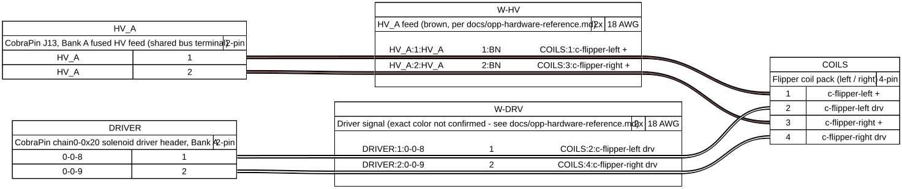

# Wiring guide

Board map, known-component wiring tables, and harness diagrams — the browsable overview of how
this machine is wired right now. **Generated** by `tools/hw_console/generate_docs.py` from
`tools/hw_console/data/components.yaml` and `machinefolder/config/hardware-*.yaml` — do not
hand-edit this file, it will be overwritten. For the step-by-step printable bench-test checklist
(what's been tested, when, pulse-ms tuning notes, pass/fail history), see the companion
`design/physical-checklists/wiring-guide.html` — open that one directly in a browser or print it
at the bench; it's kept separate on purpose so there's exactly one place that fast-changing log
gets updated, not two drifting copies.

Generated: 2026-09-14.

## Board map

Six physical CPU boards across three USB-serial chains. **This machine is being rewired from
scratch — board assignment follows a fixed priority: CobraPin first (chain 0, then chain 1), the
red PSOC boards (chain 2) only as a fallback when CobraPin can't fit something, and every LED
goes on CobraPin, no exceptions.** See [OPP hardware reference](/docs/opp-hardware-reference) for
the full rulebook — bank/HV-feed wiring, the red-board pairing rules, and why the two families
follow different numbering. Counts below are real, derived from `hardware-switches.yaml` /
`hardware-coils.yaml` / `hardware-leds.yaml` — remaining free capacity per board isn't tracked as
structured data anywhere in this repo (see `board Overviews.xlsx` or physical inspection for
that).

| Board | Port | Role | Switches in use | Coils in use | Reserved (off-limits) | LEDs in use |
|---|---|---|---|---|---|---|
| Chain 0 / Board 0x20 (CobraPin) | COM4 | cobrapin-switches-coils-leds | 8 | 7 | 4 | 40 |
| Chain 1 / Board 0x20 (CobraPin) | COM5 | cobrapin-switches-coils-leds | 0 | 0 | 0 | 1 |
| Chain 2 / Board 0x20 (PSOC card 0) | COM6 | psoc-switches-coils | 16 | 4 | 0 | 0 |
| Chain 2 / Board 0x21 (PSOC card 1) | COM6 | psoc-switches-coils | 16 | 1 | 0 | 0 |
| Chain 2 / Board 0x22 (PSOC card 2, incl. incandescent card) | COM6 | psoc-switches-coils-incand | 0 | 0 | 0 | 0 |
| Chain 2 / Board 0x23 (PSOC card 3) | COM6 | psoc-switches-coils | 20 | 0 | 0 | 0 |

## Components

Status is the 1-6 build-lifecycle stage from `components.yaml`
(`registry.COMPONENT_STATUSES`): 1 idea · 2 hardware, no purpose · 3 hardware with a purpose,
not renovated · 4 renovated, not wired · 5 wired, not tested · 6 wired & tested.

| Component | Switches | Coils | Board(s) | Status |
|---|---|---|---|---|
| Slings (autofire) | s-left-sling 0-0-19, s-right-sling 0-0-25 | c-sling-left 0-0-12, c-sling-right 0-0-0 | chain0-0x20 | 6 — wired & tested |
| Ball saver post | s-ball-saver 0-0-24 | c-ball-saver 0-0-13 | chain0-0x20 | 6 — wired & tested |
| Pop bumpers (autofire) | s-popbumper-1 2-0-8, s-popbumper-2 2-0-9, s-popbumper-3 2-0-10 | c-popbumper-1 2-0-4, c-popbumper-2 2-0-5, c-popbumper-3 2-0-6 | chain2-0x20 | 4 — renovated, not wired |
| Plunger lane / auto-launch | s-plunger-lane 0-0-26 | c-plunger 0-0-10 | chain0-0x20 | 6 — wired & tested |
| Start / launch cabinet buttons | s-start 0-0-27, s-launch 0-0-3 | — | chain0-0x20 | 6 — wired & tested |
| Ball trough | s-trough1 2-1-16, s-trough2 2-1-17, s-trough3 2-1-18, s-trough4 2-1-19, s-trough5 2-1-20, s-trough6 2-1-21, s-trough-jam 2-1-22 | c-trough-eject 0-0-11 | chain0-0x20, chain2-0x21 | 4 — renovated, not wired |
| Drop target bank | s-drop1 2-1-23, s-drop2 2-1-24, s-drop3 2-1-25 | c-drop 2-0-7 | chain2-0x20, chain2-0x21 | 3 — hardware with a purpose, not renovated |
| Top lanes (3) | s-toplane1 2-0-19, s-toplane2 2-0-20, s-toplane3 2-0-21 | — | chain2-0x20 | 4 — renovated, not wired |
| Bottom lanes (4 real + 1 rollover, not 5 lanes - see notes) | s-bottomlane1 2-0-27, s-bottomlane2 2-0-28, s-bottomlane3 2-0-31, s-bottomlane4 2-0-30, s-bottomlane5 2-0-29 | — | chain2-0x20 | 4 — renovated, not wired |
| Orbits (left/right/top) | s-orbit-l 2-0-23, s-orbit-r 2-0-22, s-orbit-top 2-1-28 | — | chain2-0x20, chain2-0x21 | 1 — idea, no hardware yet |
| Standup targets (E/R/M/L banks) | s-target-e1 2-0-24, s-target-e2 2-0-25, s-target-r1 2-3-0, s-target-r2 2-3-1, s-target-m1 2-3-2, s-target-m2 2-3-3, s-target-m3 2-3-4, s-target-m4 2-3-5, s-target-l1 2-3-6 | — | chain2-0x20, chain2-0x23 | 1 — idea, no hardware yet |
| Ramps (left/right, entry+exit) | s-ramp-r1 2-3-7, s-ramp-l1 2-3-8, s-ramp-r2 2-3-9, s-ramp-l2 2-3-10 | — | chain2-0x23 | 1 — idea, no hardware yet |
| VUKs (mid-field, top) | s-vukmid 2-1-26, s-vuktop 2-1-27 | — | chain2-0x21 | 1 — idea, no hardware yet |
| Portal ball transfer (dropper -> portal -> exit) | s-dropper 2-1-30, s-portal-r 2-1-29, s-portal-m 2-3-12, s-exit-success 2-1-31 | — | chain2-0x21, chain2-0x23 | 1 — idea, no hardware yet |
| Aerial plate / Insinerator target | s-aerial 2-3-11, s-insinerator 2-3-13 | — | chain2-0x23 | 3 — hardware with a purpose, not renovated |
| Cabinet action button | s-button 2-0-26 | — | chain2-0x20 | 4 — renovated, not wired |
| Flippers | s-left-flipper 0-0-1, s-right-flipper 0-0-2 | c-flipper-left 0-0-8, c-flipper-right 0-0-9 | chain0-0x20 | 6 — wired & tested |
| Right ramp diverter + subway | s-subway-entry 2-3-18, s-subway-exit 2-3-19 | c-ramp-diverter 2-1-2 | chain2-0x21, chain2-0x23 | 1 — idea, no hardware yet |
| Service mode nav switches | sw_service_enter 2-3-14, sw_service_esc 2-3-15, sw_service_up 2-3-16, sw_service_down 2-3-17 | — | chain2-0x23 | 1 — idea, no hardware yet |

## Harness diagrams

Cable diagrams rendered by [WireViz](https://github.com/wireviz/WireViz) from
`tools/hw_console/data/harnesses/*.yaml` — see that directory for the source data, and
[OPP hardware reference](/docs/opp-hardware-reference) for the underlying bank/HV-feed/wire-color
rules each one is built from.

### Flipper Bank A

---

Generated by `tools/hw_console/generate_docs.py` from `tools/hw_console/data/components.yaml`
and `machinefolder/config/hardware-*.yaml` (board map, components), plus
`tools/hw_console/data/harnesses/*.yaml` via WireViz (harness diagrams). If a component's wiring
status changes, update `components.yaml` (or the hw_console web UI) first, then re-run the
generator to match. New component wiring should follow
`.claude/skills/wire-component/SKILL.md`'s process so this page, the registry, and the config all
stay in sync.
